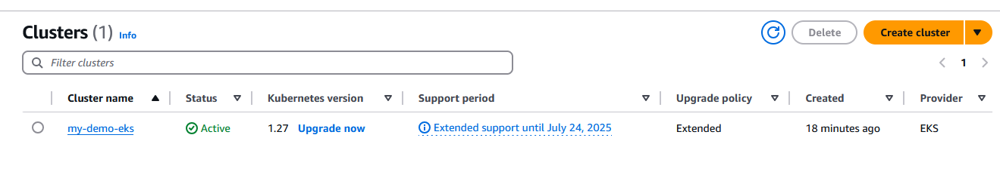
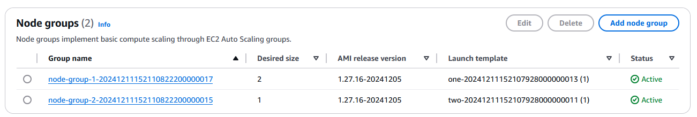
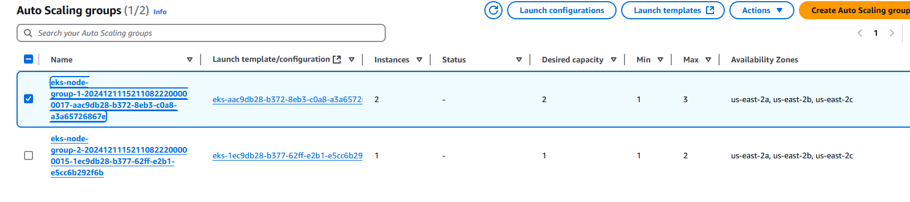
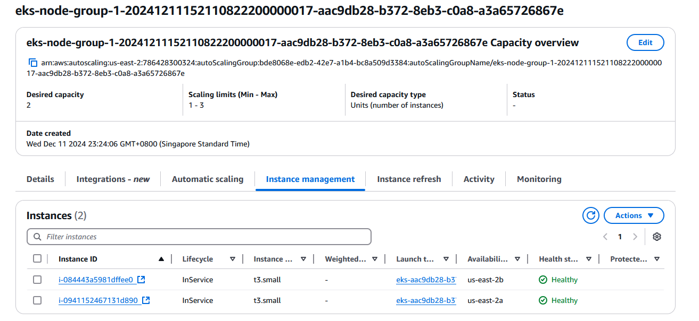
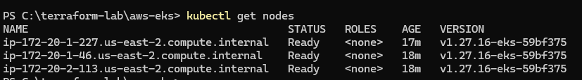

# AWS EKS with Terraform

This lab demonstrates the deployment of an Amazon Elastic Kubernetes Service (EKS) cluster using Terraform. 

It leverages Terraform's VPC module and EKS module to simplify infrastructure creation and management.


## What is EKS?

Amazon Elastic Kubernetes Service (EKS) is a managed Kubernetes service that simplifies the deployment and operation of Kubernetes clusters. EKS takes care of:

   - Control Plane Management:
   		- Provisioning and maintaining master nodes
   		- Installing control plane processes:
   			- API Server
           	- Scheduler
   			- Controller Manager
   			- Etcd
   			- Scaling and performing backups

While AWS manages the control plane, users are responsible for configuring and managing worker nodes.

## Worker Node Options in EKS

EKS offers three approaches for managing worker nodes:

### 1. Self-Managed Nodes

- Users provision EC2 instances manually.
- Requires installing and maintaining:
	- kubelet
	- kube-proxy
	- Container runtime
- Updates and security patches are user-managed.
- Nodes must be manually registered with the EKS control plane.

### 2. Managed Node Groups (Used in this project)
- Automates the lifecycle management of worker nodes.
- Nodes use EKS-optimized AMIs.
- AWS provides streamlined management:
	- Creation
	- Updates
	- Termination
- Nodes are part of an auto-scaling group managed by EKS.
- Simplifies operations with a single API call.

### 3. Fargate

- Serverless worker node model.
- Fargate provisions worker nodes on demand based on container requirements.
- Automatically optimizes EC2 sizing and configuration.
- No need to maintain EC2 servers.
- Pay only for what you use.

## EKS Cluster Setup Steps

By understanding the steps and requirements for EKS cluster setup, leveraging Terraform EKS Modules simplifies and streamlines the process.

1. Configure Cluster
- Define the cluster name and Kubernetes version.
- Create an IAM role for the cluster to handle:
     - Node provisioning
     - Storage management
     - Secrets management
- Provision VPC and subnets to host the cluster.
- Define a security group for the cluster.

2. Configure Worker Nodes (Managed Node Groups)

- Create a Node Group.
- Specify the instance type for worker nodes.
- Set the minimum and maximum number of nodes.
- Link the Node Group to the EKS cluster.

## Usage
### Prerequisites

1. Terraform installed on your machine.
2. AWS CLI configured with appropriate permissions.
3. S3 Bucket for Terraform S3 Backend
4. Kubectl installed for Kubernetes cluster management.  


## Steps

1. Clone this repository:
```
git clone https://github.com/minpyaemaw123/terraform.git
cd terraform/aws-eks
```

2. Initialize Terraform:
```
terraform init
```
3. Review the configuration and apply:
```
terraform plan
terraform apply
```
4. Connect to the EKS cluster:
```
aws eks --region us-east-2 update-kubeconfig --name my-demo-eks

Added new context arn:aws:eks:us-east-2:786428300324:cluster/my-demo-eks to C:\Users\MPM\.kube\config

kubectl get nodes
```


## Verification


**Cluster Created**



**Node Groups**



**Auto-Scaling Groups**




**Node - Instances**



Checking from CLI

