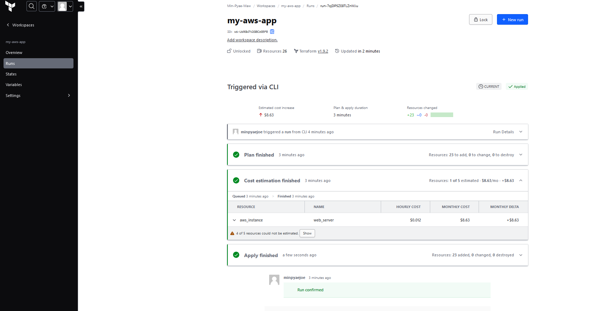
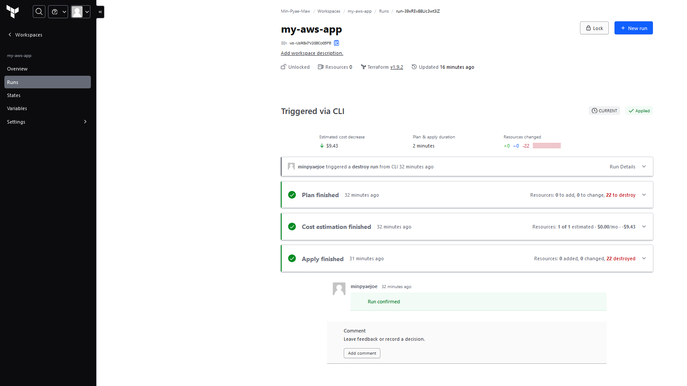

# AWS Infrastructure Deployment with Terraform

## Overview


This project demonstrates deploying an AWS infrastructure using Terraform. It includes configurations for VPC, subnets, route tables, security groups, NAT gateway, and an EC2 instance with provisioning scripts. Additionally, the configuration leverages ***Terraform Cloud as the remote backend for state management**.

## Prerequisites

1. Terraform installed on your local machine.

2. AWS credentials configured using environment variables or AWS CLI.

3. Access to Terraform Cloud for backend configuration.

## Steps

1. **Configure the AWS Provider:** Specify the AWS region.

2. **Define VPC and Subnets:** Create a VPC and public/private subnets.

3. **Set Up Security Groups:** Configure security groups with dynamic rules.

4. **Configure Routing:** Create and associate route tables.

5. **Deploy NAT Gateway and Internet Gateway:** Enable internet connectivity for public and private subnets.

6. **Launch EC2 Instance:** Deploy an EC2 instance with provisioning (Nginx and simple web page).


7. **Apply the Configuration:** Deploy the infrastructure using terraform apply.

## Verification

All resources were created successfully, and the results can be monitored from the Terraform Cloud Workspace.



The instance is up and running with the NGINX server, and the web page, ***provisionied using remote-exec***, is functioning correctly.


## Cleanup

To remove all resources:

```
terraform destroy
```


